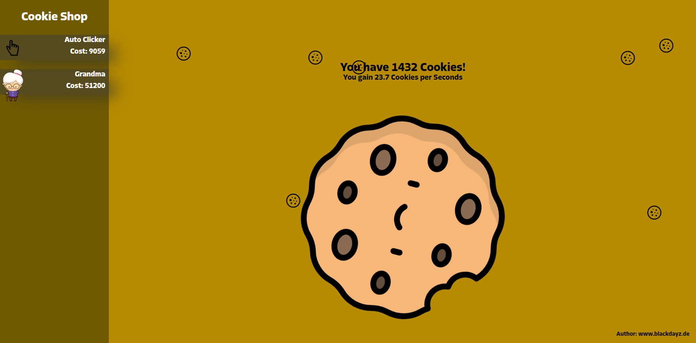

<br />
<p align="center">
  <a href="">
    
  </a>

  <h1 align="center">Cookie Clicker Remake with JavaScript</h1>

  <p align="center">
     Very basic Cookie Clicker for your Website using JavaScript.
    <br /> 
    <br />
    <a href="https://www.blackdayz.de/OpenSourceProjekte/Cookie_Clicker_V2/">View Demo</a>
    ·
    <a href="https://github.com/Mittelblut9/MyOpenSourceProjects/issues">Report Bug</a>
    ·
    <a href="https://github.com/Mittelblut9/MyOpenSourceProjects/issues">Request Feature</a>
    ·
    <a href="https://github.com/Mittelblut9/MyOpenSourceProjects/labels/feedback" title="Send feedback with the Label 'Feedback'">Send Feedback</a>
    ·
    <a href="https://github.com/Mittelblut9/MyOpenSourceProjects/pulls">Pull Request</a>
  </p>
</p>

<br />
<br />

<!-- TABLE OF CONTENTS -->
# Table of Contents

* [About the Project](#about-the-project)
  * [Built With](#built-with)
* [Getting Started](#getting-started)
  * [Prerequisites](#prerequisites)
  * [Installation](#installation)
* [Documentation](#Documentation)
* [Roadmap](#roadmap)
* [Contributing](#contributing)
* [License](#license)
* [Contact](#contact)
* [Acknowledgements](#acknowledgements)


<!-- ABOUT THE PROJECT -->
# About The Project



It's a very Basic Cookie Clicker using Javascript. Click and gain Cookies. The Cookies will be saved in Cookies so you can start on your score after a refresh or on another day.

But, why do i need this?:
* Its very simple to understand how it works. When you wanna learn JavaScript you can take a look on the Code.
* You have to do a simple Javascript Homework for your school? No Problem!
* You are a proffesional JavaScript Developer and you wann code some features? Take this and code your features! I appreciate it when you send me on GitHub the new features you coded.

### Built With
This section should list any major frameworks that you built your project using. Leave any add-ons/plugins for the acknowledgements section. Here are a few examples.
* [JQuery](https://jquery.com)

<!-- GETTING STARTED -->
# Getting Started

### Prerequisites

When you wanna install the Project, follow the introduction.
* npm
```sh
npm install npm@latest -g
```

### Installation

1. Clone the repo
```sh
git clone https://github.com/Mittelblut9/MyOpenSourceProjects/Cookie_Clicker_V2.git
```
2. Install NPM packages
```sh
npm install
```
<br />

# Documentation

The Documentation will come in the future :D


If somewhere are spelling errors or something is not that good explained
pls write a Issuesmessage on github under 
https://github.com/Mittelblut9/MyOpenSourcePorjects/issues

If you find errors and fix them, I would be very grateful 
if you send the error-free version with a pull request to my repositories. 
Everyone after you would be very grateful to you.

Feedback? Send it also to the issues page with the label "feedback"!

<br /><br />
<!-- ROADMAP -->
# Roadmap

See the [open issues](https://github.com/Mittelblut9/MyOpenSourceProjects/Cookie_Clicker_V2/issues) for a list of proposed features (and known issues).


<!-- CONTRIBUTING -->
## Contributing

Contributions are what make the open source community such an amazing place to be learn, inspire, and create. Any contributions you make are **greatly appreciated**.

1. Fork the Project
2. Create your Feature Branch (`git checkout -b feature/AmazingFeature`)
3. Commit your Changes (`git commit -m 'Add some AmazingFeature'`)
4. Push to the Branch (`git push origin feature/AmazingFeature`)
5. Open a Pull Request


<!-- LICENSE -->
# License

Distributed under the MIT License. See `LICENSE` for more information.


<!-- CONTACT -->
# Contact

[BlackDayz.de](https://www.blackdayz.de) - [@blackdayz_de](https://www.instagram.com/blackdayz_de/) - info@blackdayz.de - 

Project Link: [https://github.com/Mittelblut9/MyOpenSourceProjects/Cookie_Clicker_V2](https://github.com/Mittelblut9/MyOpenSourceProjects/Cookie_Clicker_V2)


<!-- ACKNOWLEDGEMENTS -->
# Acknowledgements
* [Choose an Open Source License](https://choosealicense.com)
* [Slick Carousel](https://kenwheeler.github.io/slick)
* [Line-awesome](https://icons8.com/line-awesome)
